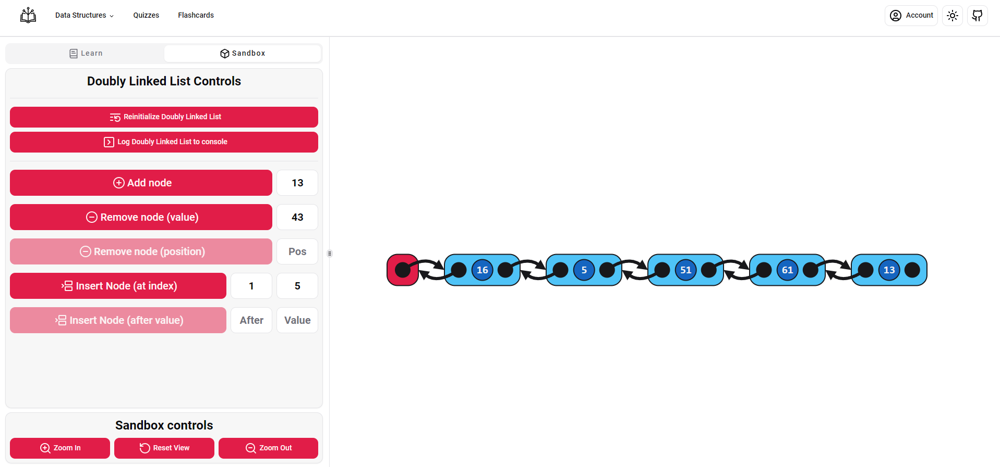
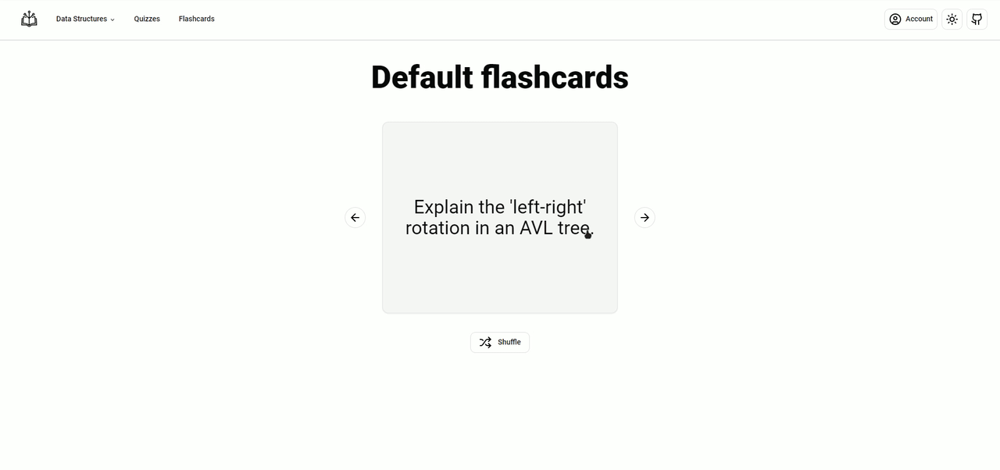

# LinkNLearn

My Bachelor's thesis project. An interactive data structures e-learning platform, built with the the SERN stack (MySQL, Express, React, Node.js).

## Preview

The application has an account system for users to track their progress, save their quizzes and create custom flashcards.

## Features

### Data Structures

The data structures page shows the user to a list of data structures, where they can click on a data structure to learn more about it.

Users are presented with a screen where:

- they can learn about the data structure
- they can interact with the datastructure (e.g. initialize, insert, delete, etc.)

### Flashcards

Users can create custom flashcards to help them study.

### Quizzes

The application supports dark mode and is mobile responsive.

